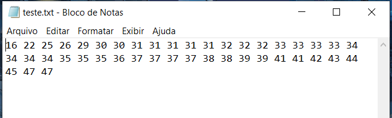
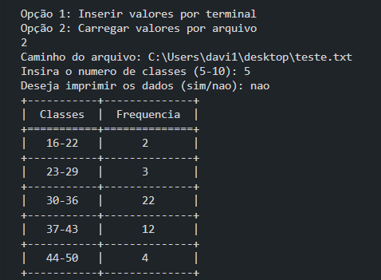

# Tabela-de-Frequencia

Programa que cria uma tabela de distribuição de frequência para um conjunto de dados.

Os dados podem ser inseridos via terminal ou carregados por arquivos.txt

A lib tabulate foi usada para criar e formatar a tebela com as classes e suas respectivas frequências.

  

1.0 - Dados em um arquivo.  

Executa-se o arquivo main.py

 
2.0 - Execução e funcionamento por carregamento de arquivo com classe = 5  

Deve-se escolher qual forma de entregar o conjunto de dados, e então escolher o número de classes e se quer a impressão dos dados.  
Após isso, a tabela contará a frequência de cada intervalo através das definições. 

 
  

2.1 - Execução e funcionamento com inserção por terminal com classe = 5  